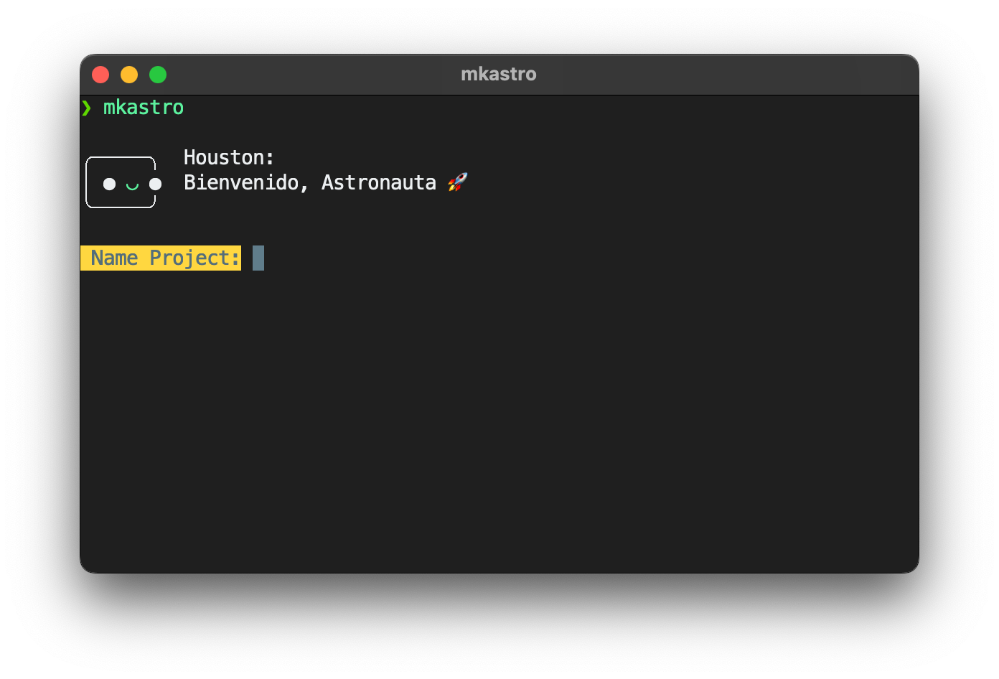

# Astro Template create

This script install a binary that is used to create a project in astro (as I use it)



## **To install the binary just type:**

```sh
cd mkastro
sudo make install
# Works in macOS & linux
#
```

### **To init a Astro project just type:**

```sh
mkastro {ProjectName} {CSSFramework} {JSFramework}
```

### **If you want use tailwind with svelte in the project using:**

```sh
mkastro {ProjectName} tailwind svelte
```

---

## CSS Framework available

-   Tailwind
-   UnoCSS

## JS Framework available

-   React
-   Svelte
-   Vue
-   Preact

> Works in macOS and Linux (May work windows with WSL)

### TO DO (For the Future)

-   Add CSS Frameworks

    -   Bootstrap
    -   Bulma
    -   Materialize

-   Add JS more Frameworks
    -   Alpine JS
    -   Lit
    -   SolidJS

### Long Future

-   Add SSR Integrators

    -   Cloudflare
    -   Netlify
    -   Node
    -   Vercel

-   Add Other Integrations
    -   Markdoc
    -   MDX
    -   PartyTown
    -   Sitemap

> I used the **Houston** Astro mascot, because I think it's cute :).

<p align='right'> with  by <strong>Spectrasonic</strong></p>
