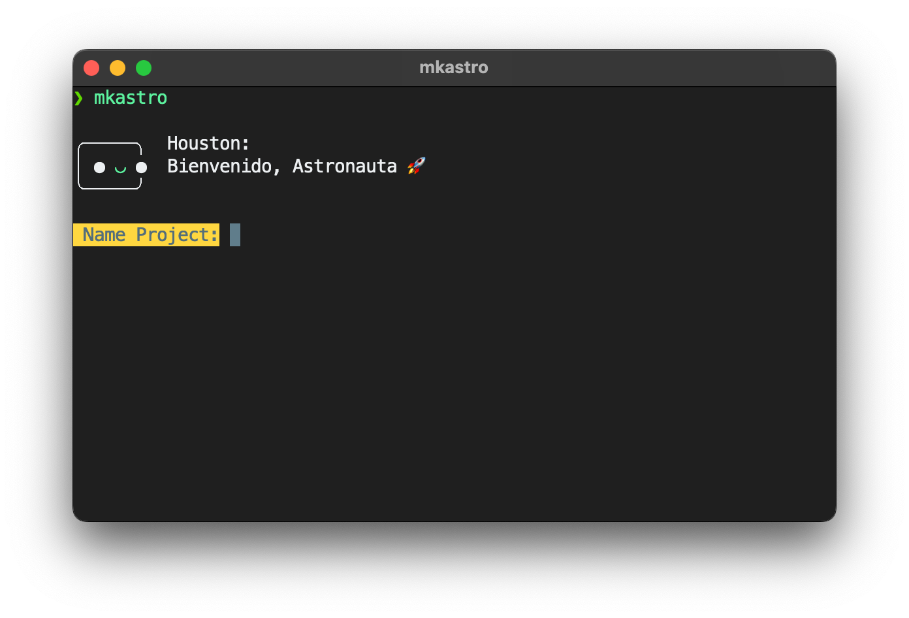

# Astro Template create

This script installs a binary that is used to create a project in astro (as I use it)



**To install the bin just type:**

```sh
cd mkastro
sudo make install
```

**To init a Astro project just type:**

```sh
mkastro
```

> Works in macOS and Linux

I used the Houtson Astro mascot, because I think it's cute.

<p align='right'> with  by <strong>Spectrasonic</strong></p>
